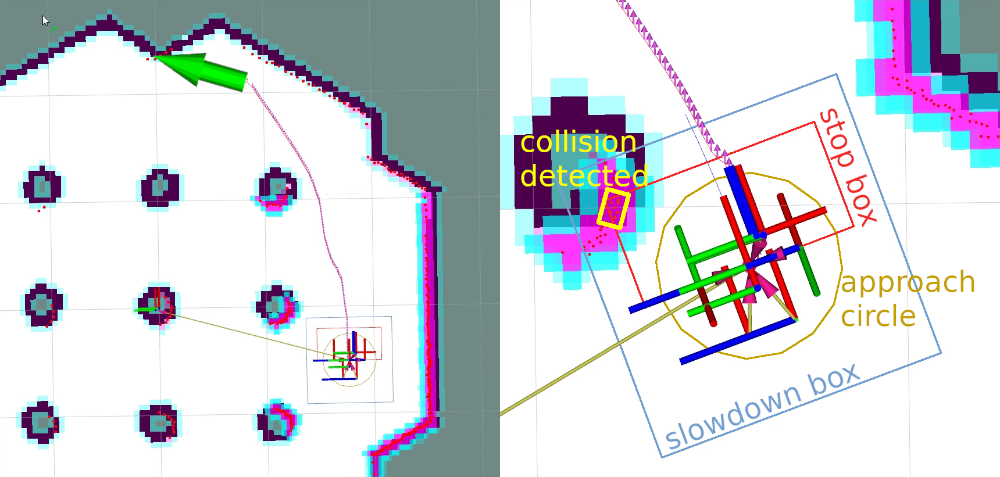
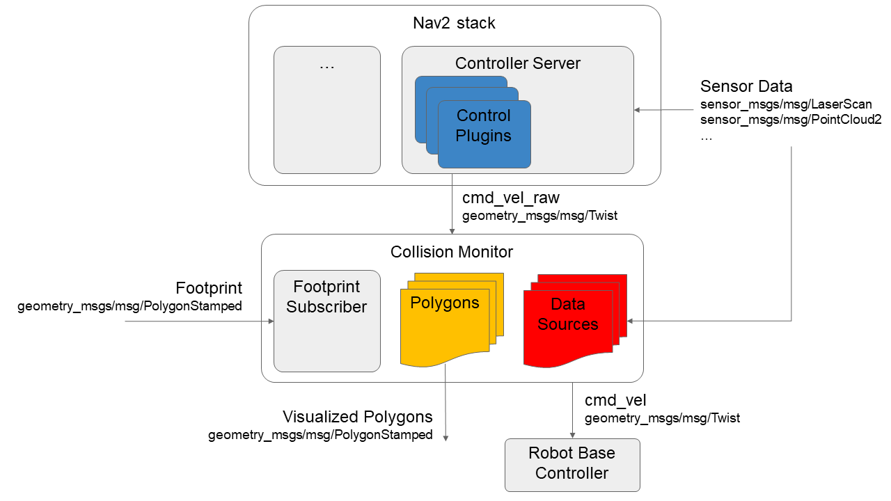

# Nav2 Collision Monitor

The Collision Monitor is a node providing an additional level of robot safety.
It performs several collision avoidance related tasks using incoming data from the sensors, bypassing the costmap and trajectory planners, to monitor for and prevent potential collisions at the emergency-stop level.

This is analogous to safety sensor and hardware features; take in laser scans from a real-time certified safety scanner, detect if there is to be an imminent collision in a configurable bounding box, and either emergency-stop the certified robot controller or slow the robot to avoid such collision.
However, this node is done at the CPU level with any form of sensor.
As such, this does not provide hard real-time safety certifications, but uses the same types of techniques with the same types of data for users that do not have safety-rated laser sensors, safety-rated controllers, or wish to use any type of data input (e.g. pointclouds from depth or stereo or range sensors).

This is a useful and integral part of large heavy industrial robots, or robots moving with high velocities, around people or other dynamic agents (e.g. other robots) as a safety mechanism for high-response emergency stopping.
The costmaps / trajectory planners will handle most situations, but this is to handle obstacles that virtually appear out of no where (from the robot's perspective) or approach the robot at such high speed it needs to immediately stop to prevent collision.

## Features

The Collision Monitor uses polygons relative the robot's base frame origin to define "zones".
Data that fall into these zones trigger an operation depending on the model being used.
A given instance of the Collision Monitor can have many zones with different models at the same time.
When multiple zones trigger at once, the most aggressive one is used (e.g. stop > slow 50% > slow 10%).

The following models of safety behaviors are employed by Collision Monitor:

* **Stop model**: Define a zone and a point threshold. If more that `N` obstacle points appear inside this area, stop the robot until the obstacles will disappear.
* **Slowdown model**: Define a zone around the robot and slow the maximum speed for a `%S` percent, if more than `N` points will appear inside the area.
* **Approach model**: Using the current robot speed, estimate the time to collision to sensor data. If the time is less than `M` seconds (0.5, 2, 5, etc...), the robot will slow such that it is now at least `M` seconds to collision. The effect here would be to keep the robot always `M` seconds from any collision.

The zones around the robot can take the following shapes:

* Arbitrary user-defined polygon relative to the robot base frame.
* Circle: is made for the best performance and could be used in the cases where the zone or robot could be approximated by round shape.
* Robot footprint polygon, which is used in the approach behavior model only. Will use the footprint topic to allow it to be dynamically adjusted over time.

The data may be obtained from different data sources:

* Laser scanners (`sensor_msgs::msg::LaserScan` messages)
* PointClouds (`sensor_msgs::msg::PointCloud2` messages)
* IR/Sonars (`sensor_msgs::msg::Range` messages)

## Design

The Collision Monitor is designed to operate below Nav2 as an independent safety node.
This acts as a filter on the `cmd_vel` topic coming out of the Controller Server. If no such zone is triggered, then the Controller's `cmd_vel` is used. Else, it is scaled or set to stop as appropriate.

The following diagram is showing the high-level design of Collision Monitor module. All shapes (Polygons and Circles) are derived from base `Polygon` class, so without loss of generality we can call them as polygons. Subscribed footprint is also having the same properties as other polygons, but it is being obtained a footprint topic for the Approach Model.

## Configuration

Detailed configuration parameters, their description and how to setup a Collision Monitor could be found at its [Configuration Guide](https://navigation.ros.org/configuration/packages/configuring-collision-monitor.html) and [Using Collision Monitor tutorial](https://navigation.ros.org/tutorials/docs/using_collision_monitor.html) pages.

## Metrics

Designed to be used in wide variety of robots (incl. moving fast) and have a high level of reliability, Collision Monitor node should operate at fast rates.
Typical one frame processing time is ~4-5ms for laser scanner (with 360 points) and ~4-20ms for PointClouds (having 24K points).
The table below represents the details of operating times for different behavior models and shapes:

| | Stop/Slowdown model, Polygon area | Stop/Slowdown model, Circle area | Approach model, Polygon footprint | Approach model, Circle footprint |
|-|-----------------------------------|----------------------------------|-----------------------------------|----------------------------------|
| LaserScan (360 points) processing time, ms  | 4.45 | 4.45 | 4.93  | 4.86  |
| PointCloud (24K points) processing time, ms | 4.94 | 4.06 | 20.67 | 10.87 |

The following notes could be made:

 * Due to sheer speed, circle shapes are preferred for the approach behavior models if you can approximately model your robot as circular.
 * More points mean lower performance. Pointclouds could be culled or filtered before the Collision Monitor to improve performance.
 
 ------------------------------------------------
 
 # Nav2 碰撞监视器

碰撞监视器是一个提供额外级别机器人安全性的节点。
它使用来自传感器的传入数据执行多项与防撞相关的任务，绕过成本图和轨迹规划器，以监控和防止紧急停止级别的潜在碰撞。

这类似于安全传感器和硬件功能； 从实时认证的安全扫描仪中获取激光扫描，检测可配置的边界框中是否即将发生碰撞，并紧急停止经过认证的机器人控制器或减慢机器人以避免此类碰撞。
然而，该节点是在 CPU 级别上使用任何形式的传感器完成的。
因此，这不提供硬实时安全认证，而是为没有安全级激光传感器、安全级控制器或希望使用任何类型的用户使用相同类型的技术和相同类型的数据。 数据输入（例如来自深度或立体或距离传感器的点云）。

这是大型重型工业机器人或在人或其他动态主体（例如其他机器人）周围高速移动的机器人的有用且不可或缺的一部分，作为高响应紧急停止的安全机制。
成本图/轨迹规划器将处理大多数情况，但这是为了处理几乎不知从哪里出现的障碍物（从机器人的角度来看），或者以如此高的速度接近机器人，以至于需要立即停止以防止碰撞。

＃＃ 特征

碰撞监视器使用相对于机器人基础框架原点的多边形来定义“区域”。
落入这些区域的数据会根据所使用的模型触发操作。
碰撞监视器的给定实例可以同时具有多个具有不同模型的区域。
当多个区域同时触发时，将使用最激进的区域（例如停止 > 慢速 50% > 慢速 10%）。

碰撞监视器采用以下安全行为模型：

* **停止模型**：定义区域和点阈值。 如果该区域内出现超过“N”个障碍点，则停止机器人，直到障碍物消失。
* **减速模型**：在机器人周围定义一个区域，如果该区域内出现超过“N”个点，则将最大速度减慢“%S”百分比。
* **接近模型**：使用当前机器人速度，根据传感器数据估计碰撞时间。 如果时间少于“M”秒（0.5、2、5 等...），机器人将减慢速度，这样现在至少需要“M”秒才能发生碰撞。 这里的效果是让机器人始终在“M”秒内避免发生任何碰撞。

机器人周围的区域可以采用以下形状：

* 相对于机器人基架的任意用户定义多边形。
* 圆形：是为了获得最佳性能而设计的，可用于区域或机器人可以近似为圆形的情况。
* 机器人足迹多边形，仅用于接近行为模型。 将使用足迹主题以允许其随着时间的推移进行动态调整。

数据可以从不同的数据源获得：

* 激光扫描仪（`sensor_msgs::msg::LaserScan` 消息）
* PointClouds（`sensor_msgs::msg::PointCloud2`消息）
* IR/声纳（`sensor_msgs::msg::Range` 消息）

＃＃ 设计

碰撞监视器设计为在 Nav2 以下作为独立的安全节点运行。
这充当来自控制器服务器的“cmd_vel”主题的过滤器。 如果没有触发此类区域，则使用控制器的“cmd_vel”。 否则，它会根据需要缩放或设置为停止。

下图显示了碰撞监视器模块的高级设计。 所有形状（多边形和圆形）都派生自“Polygon”基类，因此不失一般性，我们可以将它们称为多边形。 订阅的足迹也具有与其他多边形相同的属性，但它是为方法模型获取的足迹主题。

＃＃ 配置

详细的配置参数、它们的描述以及如何设置碰撞监视器可以在其[配置指南](https://navigation.ros.org/configuration/packages/configuring-collision-monitor.html)和[使用碰撞监视器]中找到 教程](https://navigation.ros.org/tutorials/docs/using_collision_monitor.html)页面。

## 指标

碰撞监控节点设计用于各种机器人（包括快速移动）并具有高可靠性，应快速运行。
激光扫描仪（具有 360 个点）的典型一帧处理时间约为 4-5 毫秒，点云（具有 24K 点）的典型一帧处理时间约为 4-20 毫秒。
下表显示了不同行为模型和形状的操作时间的详细信息：

| | 停止/减速模型，多边形区域 | 停止/减速模型，圆形区域 | 接近模型，多边形足迹| 接近模型，圆形足迹|
|-|------------------------------------|------------ -----------------------|---------------------------- ----------|----------------------------------|
| LaserScan（360 点）处理时间，毫秒 | 4.45 | 4.45 4.45 | 4.45 4.93 | 4.93 4.86 | 4.86
| 点云（24K 点）处理时间，毫秒 | 4.94 | 4.94 4.06 | 4.06 20.67 | 20.67 10.87 | 10.87

可以做以下注释：

  * 由于速度太快，如果您可以将机器人近似建模为圆形，则圆形是接近行为模型的首选。
  * 点数越多意味着性能越低。 可以在碰撞监视器之前剔除或过滤点云以提高性能。
